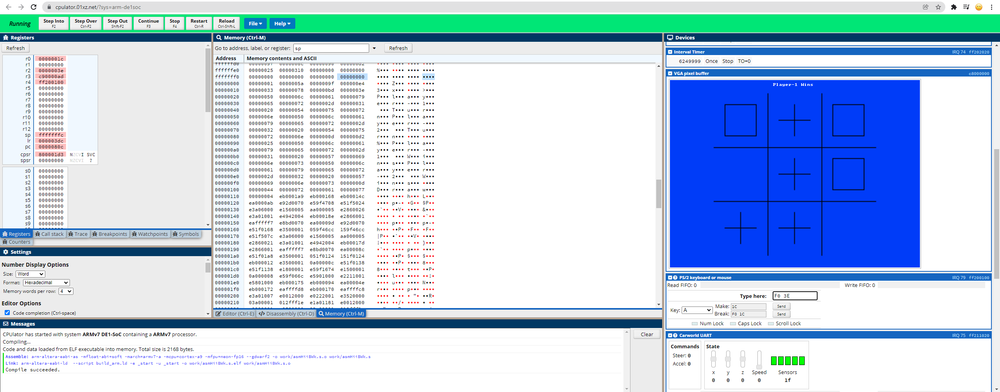

# ARM_Projects_Archive

## Running the code (.s source files)

- Step 1: Open the [**CPUlator**](https://cpulator.01xz.net/?sys=arm-de1soc) simulator website (if asked, choose **ARMv7 -> ARMv7 DE1-SoC**)
- Step 2: Delete the content in the editor
- Step 3: Copy paste the code from the .s file to the editor
- Step 4: Click `Compile and Load (F5)`
- Step 5: Click `Continue (F3)` on the top bar

___

## Notes

- To run another .s file or to reset the simulator, refresh the webpage
- The return value will usually be stored in `R0`. However, some programs are designed to run in a loop and never return

___

## Featured: [`Tic-Tac-Toe Game`](04_tic-tac-toe/tic-tac-toe.s)

